# How Network Topology Shapes Opinion Dynamics Process
In this study, a group of interacting individuals among whom the process of opinion generation takes place is considered. This project consists of two main chapters that, through theoretical analysis and simulation experiments, aim to answer several key questions regarding opinion dynamics:
- **Chapter 1** focuses on DeGroot model and it aims to understand if and under what conditions the individuals’ opinions converge in different scenarios. 
- **Chapter 2** considers the EPO model and it investigates if there is a direct relationship between key model parameters and the structural characteristics of the network.

The complete report is available [here](./Project_CCSN_Romano.pdf).

## DeGroot Model

The DeGroot model describes how opinions evolve within a social network. Each of the **n individuals** is represented as a node in a graph, and their opinion on a topic changes over discrete time steps based on their neighbors' influence.

The opinion update rule is:

```math
x(k+1) = A x(k)
```
Here, **A** is a weight matrix where each element **aᵢⱼ** represents how much importance individual *i* gives to the opinion of individual *j*.

For the following **simulations**, the different types of networks are generated in MATLAB
using the Erdős-Rényi probabilistic model algorithm.

### Strongly Connected Aperiodic Graph
The associated adjacency matrix A is row-stochastic and primitive.
<div align="center">
  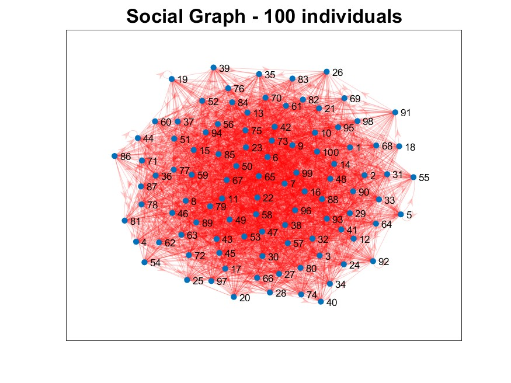
  <p><em>SC and Aperiodic Graph G of 100 individuals</em></p>
</div>
<div align="center">
  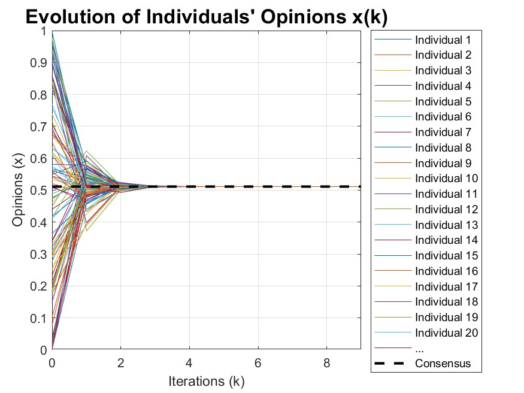
  <p><em>DeGroot Model - Opinion dynamics in a SC and Aperiodic Graph G of 100 individuals</em></p>
</div>

### Strongly Connected Aperiodic Graph
The associated adjacency matrix A is doubly-stochastic and primitive.
<div align="center">
  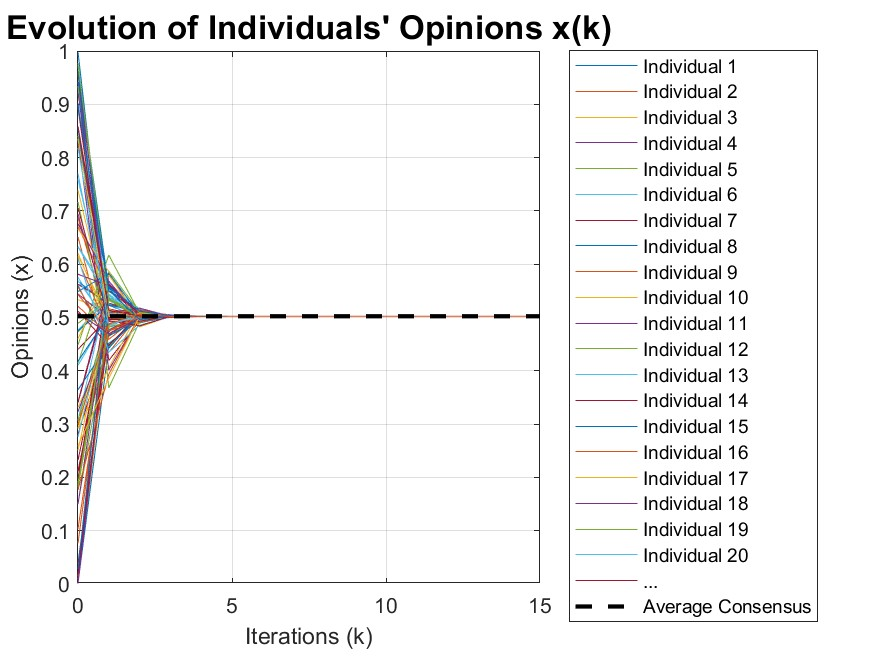
  <p><em>DeGroot Model - Opinion dynamics with a Doubly Stochastic A</em></p>
</div>

### Non-Strongly Connected Graph with One Destination
The graph describing this situation is a Non-Strongly Connected graph, characterized by a single destination.
<div align="center">
  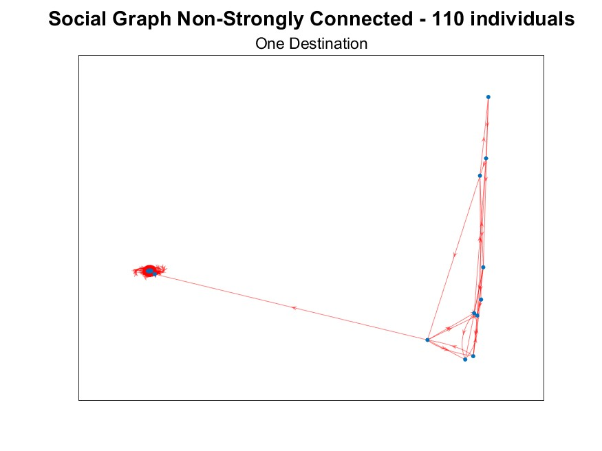
  <p><em>Connected Components of G</em></p>
</div>
<div align="center">
  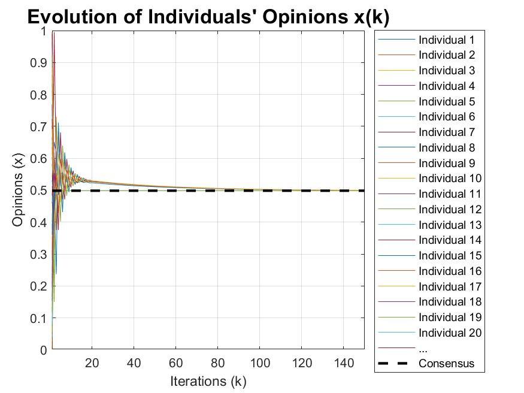
  <p><em>DeGroot Model - Opinion dynamics with N-SC graph</em></p>
</div>

### Non-Strongly Connected Graph with Multiple Destinations
The graph describing this situation is a Non-Strongly Connected graph with two
aperiodic destinations. The source is more connected to one destination than to the other.

<div align="center">
  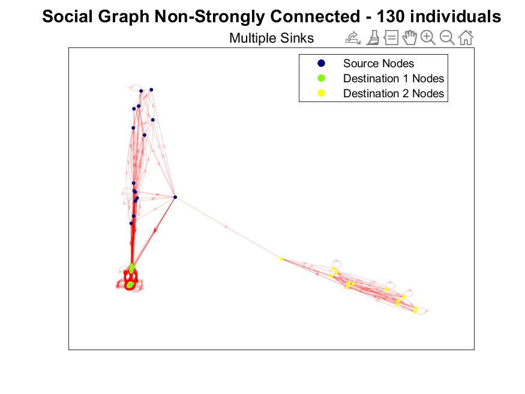
  <p><em>Non-SC Graph with Multiple Destinations: Source is more connected with
Destination1</em></p>
</div>
<div align="center">
  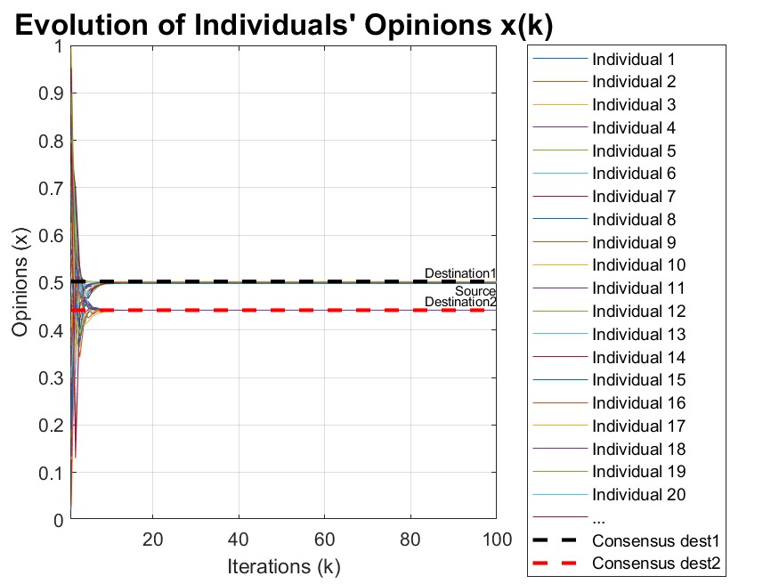
  <p><em>DeGroot Model - Opinion dynamics with N-SC graph with Multiple Destinations:
Source is more connected with Destination1</em></p>
</div>

## EPO Model
The mathematical formulation of the **EPO (Expressed and Private Opinion)** model is a refinement of the Friedkin-Johnsen model. In this framework, each individual *i* at time step *k* holds both a **private opinion** *xᵢ(k)* and an **expressed opinion** *x̂ᵢ(k)*.
Considering a population of *n* individuals, the evolution of private and expressed opinions is governed by the following equations:
```math
xᵢ(k + 1) = λᵢ \left[ aᵢᵢ xᵢ(k) + \sum_{j ≠ i} aᵢⱼ \hat{x}_ⱼ(k) \right] + (1 − λᵢ) xᵢ(0)
```
```math
\hat{x}_ᵢ(k) = \phiᵢ xᵢ(k) + (1 − \phiᵢ) \hat{x}_{avg}(k − 1)
```
where:
- **A** is a non-negative, row-stochastic matrix representing the influence weights.
- **λᵢ** represents individual *i*’s susceptibility to influence.
- **ϕᵢ** denotes individual *i*’s resistance to group pressure.
- **x̂_avg(k − 1)** is the average of all expressed opinions at the previous time step, also known as the **public opinion**.
In this context, a linear relationship between the parameters λ and ϕ and key features of the network topology can be established—specifically, the **clustering coefficient** and the **closeness centrality** of each node in the network:
```math
λᵢ = a · cᵢ + b
```
```math
ϕᵢ = 1 − (u · centralityᵢ + v)
```
In the following sections, EPO model simulations will explore how different network topologies impact the dynamics of private and expressed opinions

### All-to-All Network
For the initial test, an All-to-All network is considered, where each node is connected to every other node. 
<div align="center">
  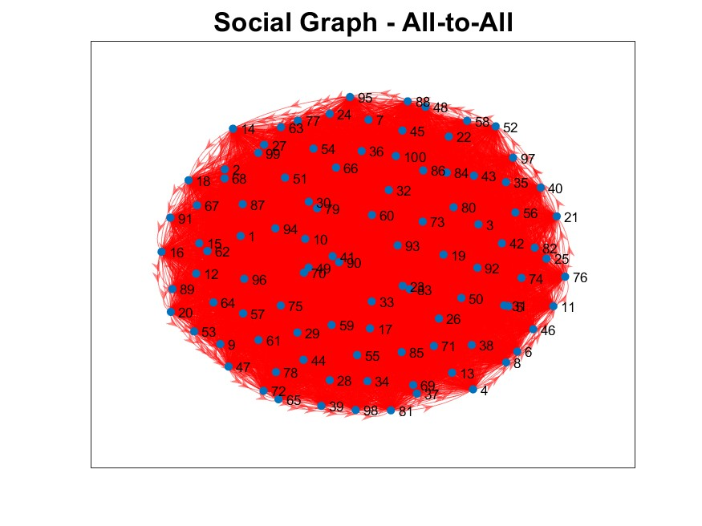
  <p><em>All-to-All Network</em></p>
</div>
<div align="center">
  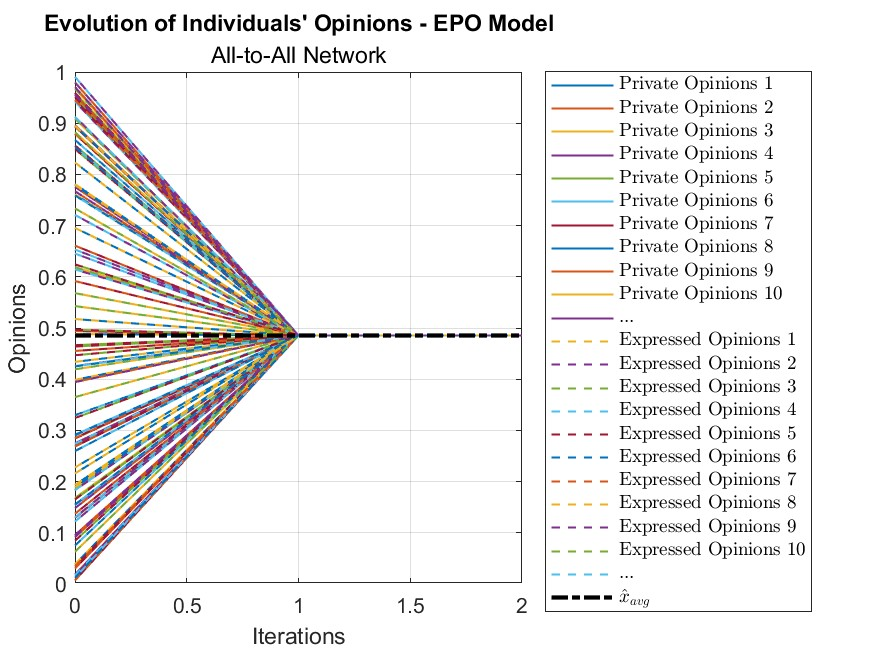
  <p><em>EPO Model - All-to-All Network</em></p>
</div>

### Star Network
Another test can be conducted on a Star network topology, where all nodes are connected to a central node. 
<div align="center">
  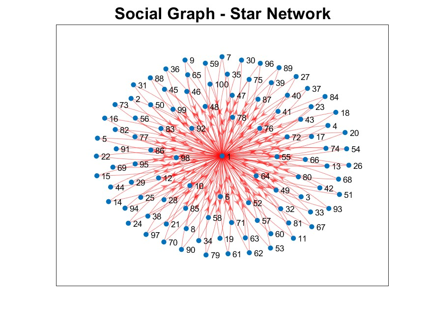
  <p><em>Star Network</em></p>
</div>
<div align="center">
  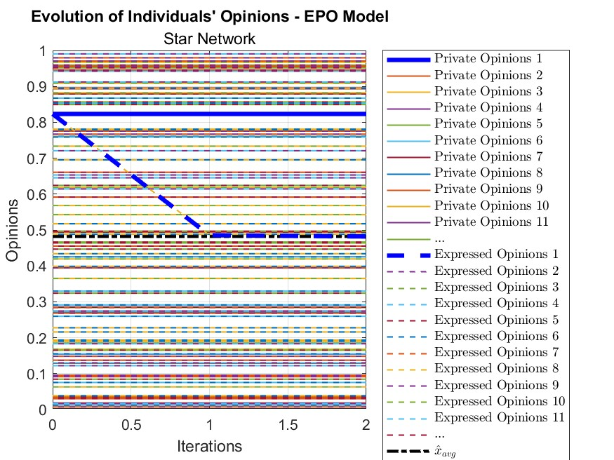
  <p><em>EPO Model - Star Network</em></p>
</div>

### k-Nearest Neighbours Network
Another experiment can be conducted on a k-Nearest Neighbors network, where each node is connected exclusively to its 6 closest neighbors.
<div align="center">
  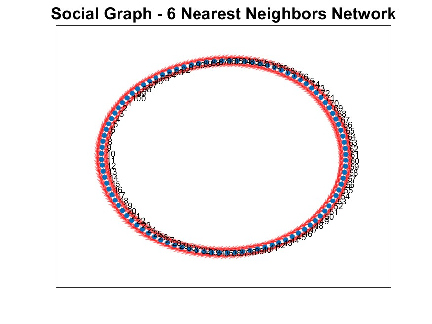
  <p><em>6 Nearest Neighbours Network</em></p>
</div>
<div align="center">
  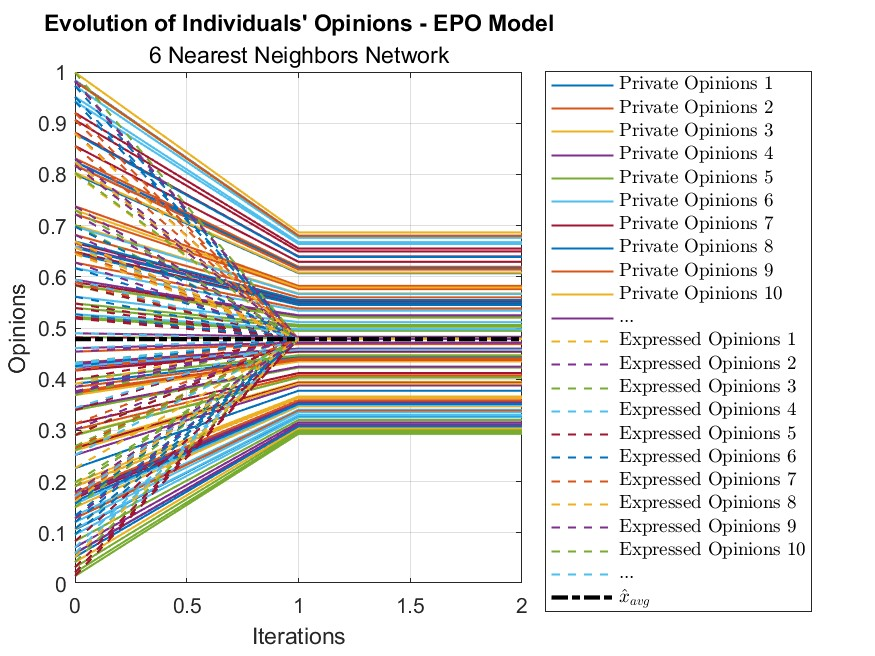
  <p><em>EPO Model - 6 Nearest Neighbours Network</em></p>
</div>

### Small World Network
Another experiment can be conducted on a Small-World network.
<div align="center">
  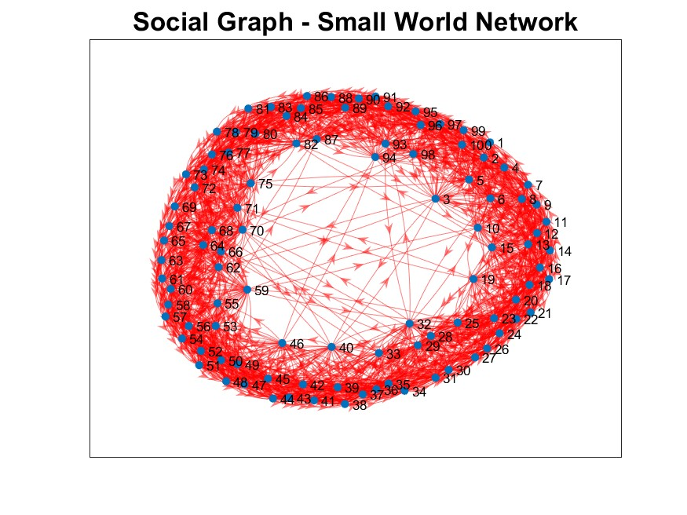
  <p><em>Small World Network</em></p>
</div>
<div align="center">
  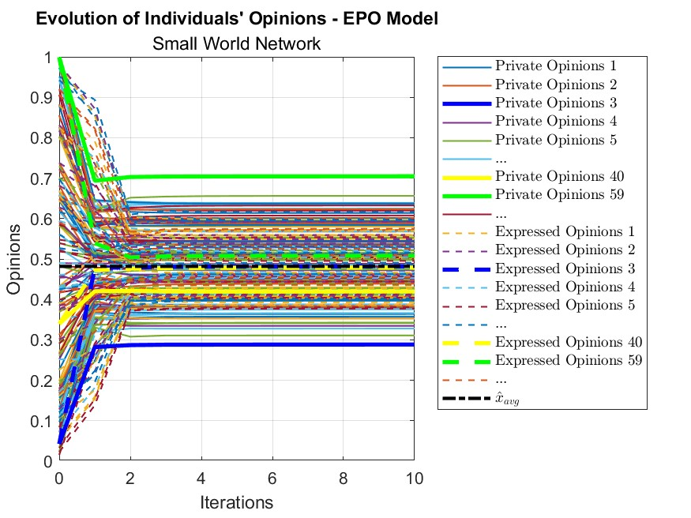
  <p><em>EPO Model - Small World Network</em></p>
</div>

### Scale Free Network
Another experiment can be conducted using the Barabási-Albert (BA) model, which is designed
to generate Scale-Free networks characterized by a power-law degree distribution.
<div align="center">
  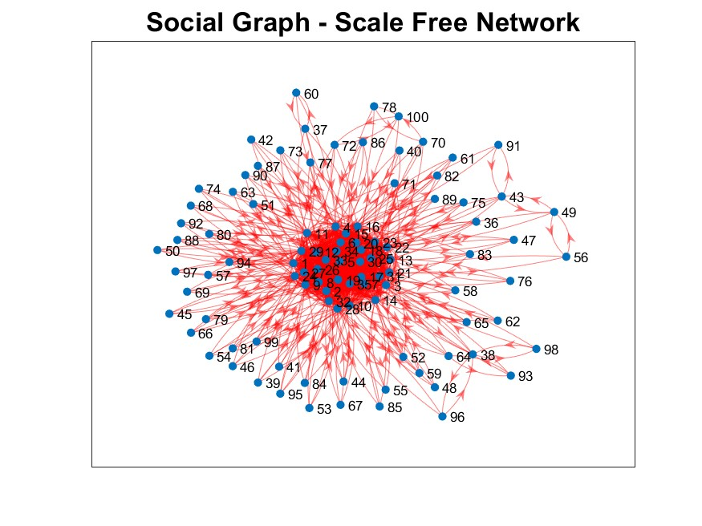
  <p><em>Scale Free Network</em></p>
</div>
<div align="center">
  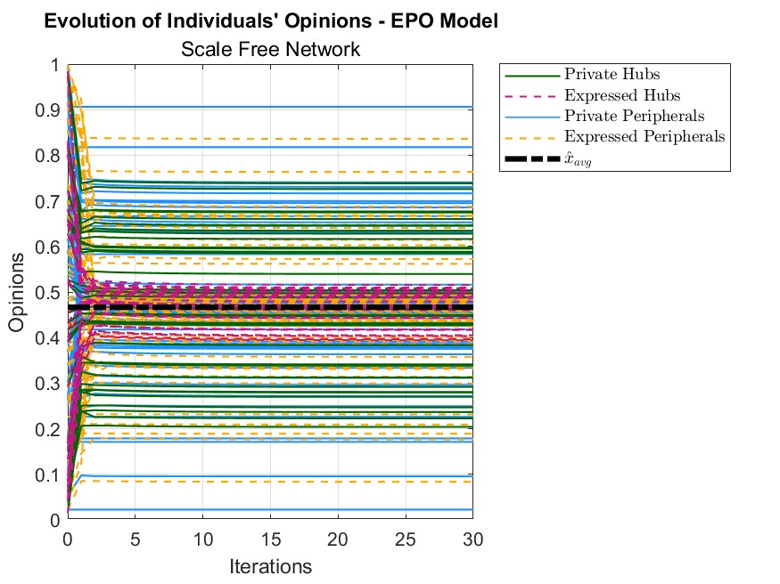
  <p><em>EPO Model - Scale Free Network</em></p>
</div>
